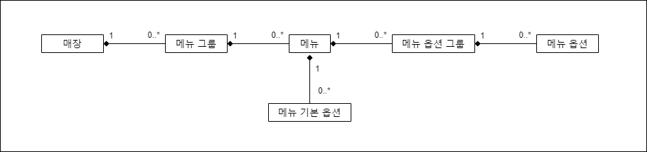

# 토이 프로젝트 - 음식 메뉴 API

## 개요
음식 주문 애플리케이션을 사용하면 음식점의 메뉴를 확인할 수 있습니다.  
평소에 이러한 메뉴 API는 어떻게 제공 되고 있을까 궁금했습니다.  
이번 프로젝트를 기회로 시중에 있는 배달 앱을 분석해보면서 API를 구현해보도록 하겠습니다.  

## 사용 기술
`스프링 부트와` `JPA`를 기본적으로 사용하며 `스프링 데이터 JPA`와 `Qerydsl`을 부분적으로 사용합니다.  
언어는 `java 8`입니다.  

## 분석
가장 쉽게 접할 수 있는 배달의 민족앱을 기준으로 분석을 해보겠습니다. (제가 좋아하는 피자샵 매장을 예시로 들겠습니다.)  
먼저 앱 내에서 음식점을 클릭하면 메뉴 리스트를 볼 수 있습니다.  
* 최상단에는 대표 메뉴가 존재하고 밑으로 **메뉴 그룹**(ex: 오리지널 피자, 스페셜 피자, 사이드 메뉴..)이 있습니다.
* 메뉴 그룹 하위에는 **메뉴**(ex: 오리지널 피자 하위에 고구마 피자, 페페로니 피자..)가 정의 되어 있습니다.  
* 메뉴 하나를 클릭하면 메뉴의 상세 페이지가 나오고 **메뉴 기본 옵션 그룹**(ex: 기본)에 **메뉴 기본 옵션**(ex: R사이즈, L사이즈)가 정의 되어 있습니다.    
* 밑으로 **메뉴 옵션 그룹**(ex: 도우 선택, 추가 사이드 메뉴)가 있으며 메뉴 옵션 그룹 하위에 **메뉴 옵션**(ex: 도우 선택 하위에 빵끝에 소보루..)이 있습니다.  

정리 해보면 다음과 같습니다.  
* 메뉴 그룹 (오리지널 피자)
  * 메뉴 (고구마 피자)
    * 메뉴 기본 옵션 그룹 (기본)
      * 메뉴 기본 옵션 (R)
      * 메뉴 기본 옵션 (L)
    * 메뉴 옵션 그룹 (도우)
      * 메뉴 옵션 (빵끝에 소보루)
      * 메뉴 옵션 (빵긑에 치즈링)  

추가로 세부사항을 더 분석하겠습니다.  
* 메뉴 기본 옵션 그룹을 제외한 항목들에는 우선순위가 있어서 주요 메뉴가 먼저 표시됩니다.  
* 메뉴, 메뉴 기본 옵션, 메뉴 옵션은 품절 여부가 표시됩니다.
* 메뉴 옵션 그룹에는 최대 선택 개수가 있어서 선택 개수를 제한할 수 있습니다.  
* 메뉴 옵션 그룹을 하나만 선택할 수 있으면 라디오 버튼으로 메뉴 옵션이 구성됩니다.  


## 요구사항
먼저 메뉴 API 사용 대상을 생각해보도록 하겠습니다.  
첫번째로 음식점 관리 애플리케이션 입니다.  
음식점 관리 앱에서는 음식점 사장님이 직접 메뉴를 등록, 수정, 삭제, 조회할 수 있어야 합니다.  

두번쨰로는 음식 주문 애플리케이션 입니다.  
음식 주문 앱에서는 음식점의 메뉴 조회가 주가 됩니다.  
음식점의 전체 메뉴를 조회하고 메뉴를 클릭했을때 보여줄 메뉴 상세 정보를 조회할 수 있어야합니다.

정리 해보면 다음과 같습니다.  

* 음식점 관리 앱
  * 메뉴 그룹을 생성한다.
  * 메뉴 그룹에서 메뉴를 등록한다.  
  * 메뉴를 등록할때 대표메뉴 여부를 설정할 수 있다.
  * 메뉴를 클릭하면 메뉴 상세 정보를 확인할 수 있다.  
  * 메뉴 상세 정보에서 기본 옵션과 메뉴 옵션 그룹을 추가 할 수 있다.
  * 메뉴 옵션 그룹에 메뉴 옵션을 추가 할 수 있다.  
  * 메뉴 옵션 그룹에는 최소 선택 개수와 최대 선택 개수를 설정할 수 있다.  
  * 메뉴그룹, 메뉴, 메뉴 기본 옵션, 메뉴 옵션 그룹, 메뉴 옵션은 우선순위를 설정할 수 있다.
  * 메뉴, 메뉴 기본 옵션, 메뉴 옵션은 품절 여부를 설정 할 수 있다.
* 음식 주문 앱
  * 매장에 등록된 전체 메뉴를 조회한다.
  * 메뉴를 클릭하면 메뉴 상세 정보가 표시된다.  

## 설계
### 도메인 모델
  
* 메뉴 그룹 -> 메뉴 -> 메뉴 옵션 그룹 -> 메뉴 옵션 순으로 일대다 관계를 설정했습니다.  
* 일대다에서 `다`의 도메인들을 `일`의 생명 주기에 종속적이라고 정의했습니다. (위 그림처럼 하나의 도메인이 다른 도메인을 혼자서 소유하는 경우 생명주기를 동일하게 가져가도 괜찮습니다. 하지만 나중에 주문과도 연계할 것을 생각하면 섣부른 결정 같아 보이지만 이번 프로젝트는 이렇게 설계 해보도록 하겠습니다.)
* 처음에는 `메뉴 기본 옵션`을 `메뉴 옵션`으로 통합해서 구성할까 생각했지만 서버와 클라이언트에서 불필요하게 신경 써야 될 로직이 증가하기 때문에 분리했습니다.  

  


### 테이블 모델

  

## 구현

### 저장

#### MenuController
```java
@PostMapping("/api/v1/store/{storeId}/menu-group")
public void saveMenuGroup(@PathVariable("storeId") Long storeId, @RequestBody MenuGroupSaveDto menuGroupSaveDto) {
    menuService.saveMenuGroup(storeId, menuGroupSaveDto);
}
```
#### MenuService
```java
@Transactional
public void saveMenuGroup(Long storeId, MenuGroupSaveDto menuGroupSaveDto) {
    Store store = storeRepository.findById(storeId)
            .orElseThrow(EntityNotFoundException::new);
    menuGroupRepository.save(menuGroupSaveDto.toEntity(store));
}
```
#### MenuGroupSaveDto
```java
@Getter
public class MenuGroupSaveDto {

    private String name;

    private Integer priority;

    public MenuGroup toEntity(final Store store) {

        MenuGroup menuGroup = MenuGroup.builder()
                .name(name)
                .priority(priority)
                .store(store)
                .build();
        return menuGroup;
    }
}
```

### 조회

#### MenuController
```java
@GetMapping("/api/v1/store/menu-group/menu/{menuId}")
public ApiResponse<MenuDto> findMenuById(@PathVariable("menuId") Long menuId) {
    return new ApiResponse<>(menuService.findMenuById(menuId));
}

@GetMapping("/api/v1/store/{storeId}/menu-group")
public ApiResponse<List<MenuGroupDto>> findAllMenuByStore(@PathVariable("storeId") Long storeId) {
    return ApiResponse.of(menuService.findAllByStore(storeId));
}
```
* 조회는 매장에 있는 모든 메뉴를 가져오는 findAllMenuByStore와 메뉴의 상세 정보를 가져오는 findMenuById 두개를 구현했습니다.  


#### MenuService
```java
public MenuDto findMenuById(Long menuId) {
     Menu findMenu = menuRepository.findById(menuId).orElseThrow(EntityNotFoundException::new);
     return new MenuDto(findMenu);
 }

 public List<MenuGroupDto> findAllByStore(Long storeId) {
     return menuGroupRepository.findAllByStore(storeId).stream()
             .map(MenuGroupDto::new)
             .collect(Collectors.toList());
 }
```
* 메뉴서비스에서는 엔티티를 dto로 변환하는 과정을 수행합니다.  

#### MenuGroupRepsoitory
```java
@Query("select distinct mg from MenuGroup mg" +
            " join mg.store s on s.id = :storeId" +
            " left join fetch mg.menus m ")
List<MenuGroup> findAllByStore(@Param("storeId") Long storeId);
```
* Jpa에서 컬렉션을 페치조인은 1개만 가능하므로 menu만 페치조인을 수행하고 나머지 연관된 엔티티 컬렉션은 지연로딩될떄 `배치사이즈` 기능을 통해 최적화를 했습니다.    

#### MenuRepository
```java
 @Query("select m from Menu m " +
            " join fetch m.menuGroup mg" +
            " left join fetch m.menuOptionGroups mo" +
            " where m.id = :id")
Optional<Menu> findById(@Param("id") Long id);
```
* 다대일인 메뉴그룹과 일대다인 메뉴옵션그룹까지 페치 조인을 수행하고 메뉴 옵션은 배치사이즈를 통해 지연로딩합니다.  

#### Menu

### 수정

### 삭제


## 리팩토링

### 연쇄 저장
`영속성 전이`기능을 사용하면 부모 엔티티가 영속 상태로 변할때 자식 엔티티도 같이 영속 상태로 변합니다.  
이를 이용해 저장 API 구현시 dto에 하위 엔티티 정보를 입력했을때 같이 저장되게 하면 어떻게 될까 생각했고 구현해보기로 했습니다.  
#### MenuGroupSaveDto
```java
@Getter
public class MenuGroupSaveDto {

    private String name;

    private Integer priority;

    private List<MenuSaveDto> menuSaveList;

    public MenuGroup toEntity(final Store store) {

        MenuGroup menuGroup = MenuGroup.builder()
                .name(name)
                .priority(priority)
                .store(store)
                .build();

        if (menuSaveList != null && menuSaveList.size() > 0) {
            menuSaveList.forEach(msd -> msd.toEntity(menuGroup));
        }
        
        return menuGroup;
    }
}
```
* MenuGroupSaveDto에 MenuSaveDto List가 추가되었고 MenuGroupSaveDto에서 toEntity 호출시 MenuSaveDto의 toEntity를 호출하게 됩니다.  
* MenuSaveDto의 toEntity에는 MenuGroup에 Menu를 추가하는 로직이 담겨져 있기 때문에 결과적으로 MenuGroup이 영속 상태로 변할때 추가한 Menu도 영속 상태로 변하게 됩니다.  
* 같은 방법으로 Menu와 MenuOptionGroup 그리고 MenuOption에도 적용해서 메뉴 그룹을 저장할때 메뉴 옵션까지 저장되게끔 바꾸었습니다.  


